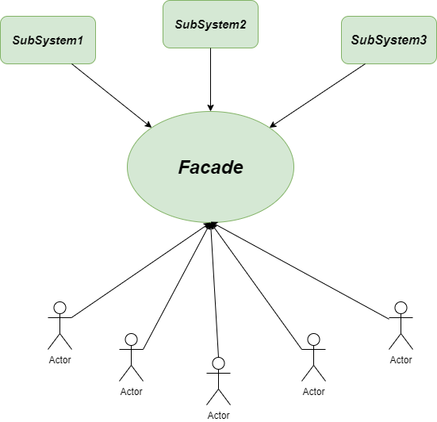

# Facade Design Pattern

In English, the word facade means a deceptive front or appearance.

Following this definition, Facade is a structural design pattern which is used to structure your code in a way that you can hide the complexity of your code and provide a simple interface to the client. Basically, it provides a simple interface to a complex subsystem.

In Simple words, The facade pattern allows you to hide all the messy logic from the client and only display the clear and easy-to-use interface to them. This allows them to interact with an API easily in a less error-prone way and without accessing the inner workings directly.



## When to use the facade pattern

- When you want to provide a simple interface to a complex subsystem
- When you want to decouple a client from a complex subsystem
- When you want to layer your subsystems
- When you want to reduce dependencies between your subsystems
- When you want to wrap a collection of APIs with a single well-designed API
- When you want to hide the implementation details of a subsystem from the client

### Real world examples

#### Withdrawing money from an ATM

When you withdraw money from an ATM, you don't need to know how the ATM works. You just need to know how to use the ATM. The ATM is a facade that hides the complexity of the ATM system from the user.

<details>
<summary>Steps involved behind the Facade</summary>

- When you want to withdraw money from ATM
  - Check if card is valid or not
  - Check if pin is correct or not
  - Check if sufficient balance is available or not
  - Deduct the amount from the account
  - Dispense the cash
  - Print the receipt
  </details>

<details>
<summary>Code Implementation</summary>

```javascript
class ATM {
  constructor(card, pin) {
    this.card = card;
    this.pin = pin;
  }

  checkCard() {
    console.log("Checking card...");
    return true;
  }

  checkPin() {
    console.log("Checking pin...");
    return true;
  }

  checkBalance() {
    console.log("Checking balance...");
    return true;
  }

  deductAmount() {
    console.log("Deducting amount...");
    return true;
  }

  dispenseCash() {
    console.log("Dispensing cash...");
    return true;
  }

  printReceipt() {
    console.log("Printing receipt...");
    return true;
  }

  withdraw(amount) {
    if (
      this.checkCard() &&
      this.checkPin() &&
      this.checkBalance() &&
      this.deductAmount() &&
      this.dispenseCash() &&
      this.printReceipt()
    ) {
      console.log(`Successfully withdrew ${amount} from your account`);
    } else {
      console.log("Failed to withdraw money from your account");
    }
  }
}
```

</details>

#### Event Management

When you want to organize an event, you don't need to know how the event management system works. You just need to know how to use the event management system. The event management system is a facade that hides the complexity of the event management system from the user.

<details>
  <summary>Steps involved behind the Facade</summary>

- When you want to organize an event
  - Check if the venue is available or not
  - Check if the caterer is available or not
  - Check if the decorator is available or not
  - Check if the photographer is available or not
  - Check if the DJ is available or not
  - Check if the event planner is available or not
  - Book the venue
  - Book the caterer
  - Book the decorator
  - Book the photographer
  - Book the DJ
  - Book the event planner
  </details>

<details>
<summary>Code Implementation</summary

```javascript
class EventManagementSystem {
  constructor(venue, caterer, decorator, photographer, dj, eventPlanner) {
    this.venue = venue;
    this.caterer = caterer;
    this.decorator = decorator;
    this.photographer = photographer;
    this.dj = dj;
    this.eventPlanner = eventPlanner;
  }

  checkVenue() {
    console.log("Checking venue...");
    return true;
  }

  checkCaterer() {
    console.log("Checking caterer...");
    return true;
  }

  checkDecorator() {
    console.log("Checking decorator...");
    return true;
  }

  checkPhotographer() {
    console.log("Checking photographer...");
    return true;
  }

  checkDJ() {
    console.log("Checking DJ...");
    return true;
  }

  checkEventPlanner() {
    console.log("Checking event planner...");
    return true;
  }

  bookVenue() {
    console.log("Booking venue...");
    return true;
  }

  bookCaterer() {
    console.log("Booking caterer...");
    return true;
  }

  bookDecorator() {
    console.log("Booking decorator...");
    return true;
  }

  bookPhotographer() {
    console.log("Booking photographer...");
    return true;
  }

  bookDJ() {
    console.log("Booking DJ...");
    return true;
  }

  bookEventPlanner() {
    console.log("Booking event planner...");
    return true;
  }

  organizeEvent() {
    if (
      this.checkVenue() &&
      this.checkCaterer() &&
      this.checkDecorator() &&
      this.checkPhotographer() &&
      this.checkDJ() &&
      this.checkEventPlanner() &&
      this.bookVenue() &&
      this.bookCaterer() &&
      this.bookDecorator() &&
      this.bookPhotographer() &&
      this.bookDJ() &&
      this.bookEventPlanner()
    ) {
      console.log("Successfully organized the event");
    } else {
      console.log("Failed to organize the event");
    }
  }
}
```

</details>

#### E-Commerce Site

When you want to buy a product from an e-commerce site, you don't need to know how the e-commerce site works. You just need to know how to use the e-commerce site. The e-commerce site is a facade that hides the complexity of the e-commerce site from the user.

<details>
<summary>Steps involved behind the Facade</summary>

- When you want to buy a product from an e-commerce site
  - Check if the product is available or not
  - add the product to the cart
  - make the payment
  - place the order
  - update the inventory
  - generate the invoice
  - send the confirmation email

</details>

<details>
<summary>Code Implementation</summary>

```javascript
class ECommerceSite {
  constructor(product, cart, payment, order, inventory, invoice, email) {
    this.product = product;
    this.cart = cart;
    this.payment = payment;
    this.order = order;
    this.inventory = inventory;
    this.invoice = invoice;
    this.email = email;
  }

  checkProduct() {
    console.log("Checking product...");
    return true;
  }

  addToCart() {
    console.log("Adding product to cart...");
    return true;
  }

  makePayment() {
    console.log("Making payment...");
    return true;
  }

  placeOrder() {
    console.log("Placing order...");
    return true;
  }

  updateInventory() {
    console.log("Updating inventory...");
    return true;
  }

  generateInvoice() {
    console.log("Generating invoice...");
    return true;
  }

  sendEmail() {
    console.log("Sending email...");
    return true;
  }

  buyProduct() {
    if (
      this.checkProduct() &&
      this.addToCart() &&
      this.makePayment() &&
      this.placeOrder() &&
      this.updateInventory() &&
      this.generateInvoice() &&
      this.sendEmail()
    ) {
      console.log("Successfully bought the product");
    } else {
      console.log("Failed to buy the product");
    }
  }
}
```

</details>
